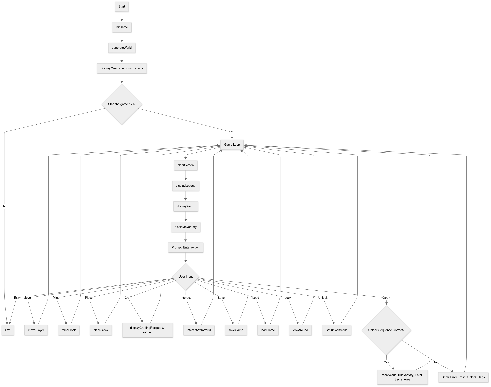
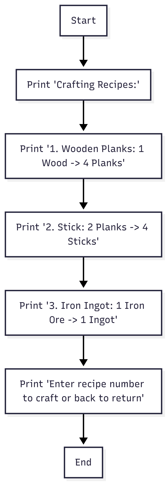

# MU 2025 ~ Project for Intro to CS 



# Main game loop JavaCraft.java
```
while true:
    clearScreen()
    displayLegend()
    displayWorld()
    displayInventory()
    print("Enter your action: ...")
    input = getUserInput()
    if input is movement:
        movePlayer(input)
    else if input == "m":
        mineBlock()
    else if input == "p":
        displayInventory()
        blockType = getUserInput()
        placeBlock(blockType)
    else if input == "c":
        displayCraftingRecipes()
        recipe = getUserInput()
        craftItem(recipe)
    else if input == "i":
        interactWithWorld()
    else if input == "save":
        fileName = getUserInput()
        saveGame(fileName)
    else if input == "load":
        fileName = getUserInput()
        loadGame(fileName)
    else if input == "exit":
        print("Exiting the game. Goodbye!")
        break
    else if input == "look":
        lookAround()
    else if input == "unlock":
        unlockMode = true
    else if input == "open":
        if unlockMode and craftingCommandEntered and miningCommandEntered and movementCommandEntered:
            secretDoorUnlocked = true
            resetWorld()
            print("Secret door unlocked!")
            waitForEnter()
        else:
            print("Invalid passkey. Try again!")
            waitForEnter()
            reset unlock flags
    else:
        print("Invalid input. Please try again.")
    if secretDoorUnlocked:
        clearScreen()
        print("You have entered the secret area!")
        inSecretArea = true
        resetWorld()
        secretDoorUnlocked = false
        fillInventory()
        waitForEnter()
```

# Function Analysis
1. displayCraftingRecipes()
    - Shows available crafting recipes.

```
function displayCraftingRecipes():
    print("Crafting Recipes:")
    print("1. Wooden Planks: 1 Wood -> 4 Planks")
    print("2. Stick: 2 Planks -> 4 Sticks")
    print("3. Iron Ingot: 1 Iron Ore -> 1 Ingot")
    print("Enter recipe number to craft or 'back' to return")
```

2. craftItem(int recipe)
    - Crafts an item if the player has the required resources.
3. saveGame(String fileName)
    - Serializes and saves the game state to a file.
4. loadGame(String fileName)
    - Loads a game state that is stored in a file that was made by the saveGame function